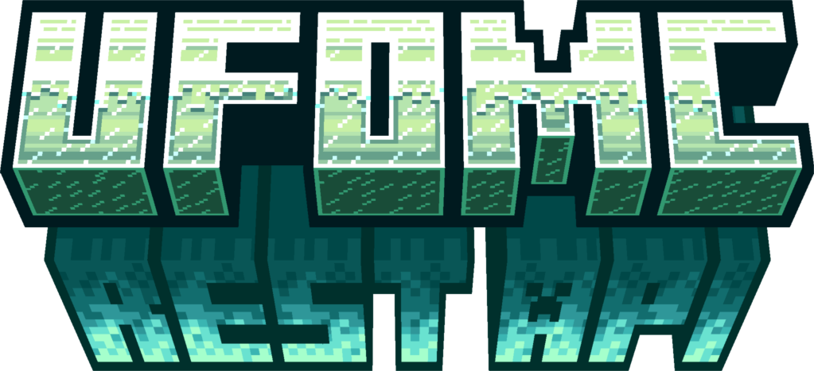

**At the time there are some bugs I need to fix. When everything is fixed up the rest will be uploaded aigan :/**

About
-----
 - I uploaded my own RestAPI. If you notice any possible bugs please feel free to contact me via discord (ufo.dev)
 - you can also contact me on discord if you have any questions about the usage or anything else

What is a rest API?
-
 - a **Rest**full API is a basically an independent application running on your server managing your data
 - it functions with building a connection to your database and receiving http requests wich tell them what to do

Why should I use a rest API?
-
 - rest api´s make a lot of sense in many different cases
 - the most important advantages of a rest api are language independence, high speed requests and independence of any other applications 
 - also its easy to use if you have basic knowledge of http and json
 - the rest API that I coded also contains a build in cache so you dont have to code one for yourself 

Usage
-----
 - use the RequestBuilder.jar to build a Request or get yourself one out of the internet
 - example for request: `http://127.0.0.1/webInteraction/database=<my database>&searchField=<user id or so>`
 - following http methodes are supported: `POST, PUT, GET, DELETE`
 - after changing anything in the config a restart is necessary

Config
------

  > web
   - `httpPath` is the path your requests need to go
   - `httpPort` is the port your request needs to be send to
   - `httpAdress` is the address your reqest needs to go to

  > database
   - `dataBaseType` is the type of your database. Valid is (`MongoDB; MariaDB; Config; MySQL`)
      If not valid automaticly `Config` is selected
   - `dataBasePort` is the port your dataBase is binded on. Default: (MongoDB 27020; SQL 3306)
   - `password` is the password of your database (only necessary for MySQL and MariaDB)
   - `user` is the user the client is connecting with (not necessary for Config)
   - `dataBaseAddress` is the address your database is located at. If it runs on the same server as the *rest* application leave it `127.0.0.1`.

  > tecnical

   - `isReady` is the boolean that tells the system if the config is ready. This is false at basic. After the first start the config gets created. Set it up, then set `isReady` to true and restart.

  > cache
   - `enableChache` tells if you want to use a cache or not (normally true but if you cache the data yourself in your app just turn it off)
   - `cacheExpiration` tells how long an object stays inside the database before expiring without beeing used in minutes
   - `maxCacheEntrySize` tells how many entrys the cache is allowed to have
   - `maxWeight` tells how big the cache is allowed to be


 > default config:
   
  ```"httpPath": "webInteraction",
  "httpPort": "1234",
  "httpAddress": "127.0.0.1",

  "dataBaseType": "config",
  "dataBasePort": "1234",
  "password": "my password",
  "user": "admin",
  "dataBaseAddress": "127.0.0.1",
  "dataBaseName": "network",

  "isReady": false,

  "enableCache": true,
  "cacheExpiration": 5,
  "maxCacheEntrySize": 1000,
  "maxWeight": 20000
```

Copyright
---------
> The Ufo Rest API is free to use. If u give me a credit or not is your choice. Please dont use it for commercial purposes! 

Request
-------

```java
import com.google.gson.Gson;

import java.io.IOException;
import java.net.URI;
import java.net.URISyntaxException;
import java.net.http.HttpClient;
import java.net.http.HttpRequest;
import java.net.http.HttpResponse;
import java.time.Duration;
import java.util.Map;
import java.util.concurrent.CompletableFuture;

public class ReqBuilder {

    private String jsonString;
    private String goalDataCollection;
    private String reqMethode;
    private String parameter;
    private boolean async;
    private final HttpClient client;

    public ReqBuilder() {
        this.async = true;
        this.client = HttpClient.newHttpClient();
    }

    public ReqBuilder async(boolean async) {
        this.async = async;
        return this;
    }

    public ReqBuilder addParameter(Map<String, String> parameters) {
        parameters.forEach((key, value) -> parameter = parameter + key + "=" + value + "&");
        this.parameter = parameter.substring(0, parameter.length() - 1);
        return this;
    }

    public ReqBuilder addObject(Object object) {
        this.jsonString = new Gson().toJson(object);
        return this;
    }

    public ReqBuilder setGoalDataCollection(String goalDataCollection) {
        this.goalDataCollection = goalDataCollection;
        return this;
    }

    public ReqBuilder setMethod(String method) {
        this.reqMethode = method;
        return this;
    }

    public String build() {

        final HttpRequest request;
        final HttpResponse<String> response;

        try {

            HttpRequest.Builder builder = HttpRequest.newBuilder()
                    .uri(new URI("http://127.0.0.1/" + goalDataCollection.toLowerCase().replace("_", "") + "/" + parameter))
                    .timeout(Duration.ofMillis(5000));

            switch (reqMethode) {
                case "GET" -> builder.GET();
                case "POST" -> builder.POST(HttpRequest.BodyPublishers.ofString(jsonString));
                case "DELETE" -> builder.DELETE();
                case "PUT" -> builder.PUT(HttpRequest.BodyPublishers.ofString(jsonString));
            }

            if (async) {
                CompletableFuture.supplyAsync(()->{

                    try {

                        HttpRequest.Builder asyncBuilder = HttpRequest.newBuilder()
                                .uri(new URI("http://127.0.0.1/" + goalDataCollection.toLowerCase().replace("_", "") + "/" + parameter))
                                .timeout(Duration.ofMillis(5000));

                        switch (reqMethode) {
                            case "GET" -> asyncBuilder.GET();
                            case "POST" -> asyncBuilder.POST(HttpRequest.BodyPublishers.ofString(jsonString));
                            case "DELETE" -> asyncBuilder.DELETE();
                            case "PUT" -> asyncBuilder.PUT(HttpRequest.BodyPublishers.ofString(jsonString));
                        }

                        final HttpRequest asyncRequest;
                        final HttpResponse<String> asyncResponse;

                        asyncRequest = asyncBuilder.build();
                        asyncResponse = client.send(asyncRequest, HttpResponse.BodyHandlers.ofString());

                        if (!(asyncResponse.statusCode() < 299 && asyncResponse.statusCode() > 200)) {
                            System.out.println("Response exit with code " + asyncResponse.statusCode());
                            return null;
                        }

                        if (reqMethode.equals("GET")) {
                            return new Gson().toJson(asyncResponse.body());
                        } else {
                            return "success";
                        }
                    } catch (IOException | InterruptedException | URISyntaxException e) {
                        throw new RuntimeException(e);
                    }

                });


            } else {
                request = builder.build();
                response = client.send(request, HttpResponse.BodyHandlers.ofString());

                if (!(response.statusCode() < 299 && response.statusCode() > 200)) {
                    System.out.println("Response exit with code " + response.statusCode());
                    return null;
                }
                if (reqMethode.equals("GET")) {
                    return new Gson().toJson(response.body());
                } else {
                    return "success";
                }
            }


        } catch (URISyntaxException | IOException | InterruptedException e) {
            throw new RuntimeException(e);
        }

        return null;
    }

}
```
